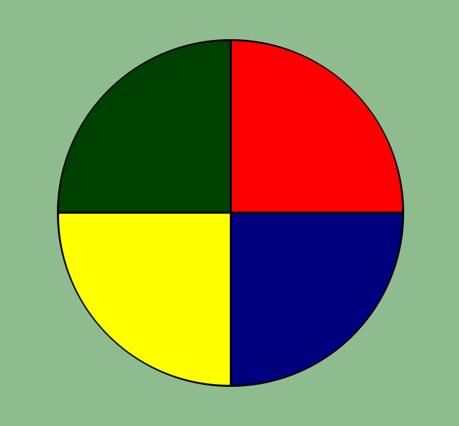

# Jogo Estilo Genius

## Sobre o projeto.
O jogo consiste em clicar nas cores certas que foram acessas. Esse projeto foi desenvolvido no Bootcamp da Digital Innovation One - Órbi Web Games Developer.

Data de conclusão: 18/04/2022

## Ferramentas e tecnologias usadas nesse projeto.
 
```js
function Genius(Project) {
    if (Front End) {
        const Stack = `${HTML}, ${CSS}, ${JavaScript}`;
    }
};
```
<br>

<div align="center">




</div>

---

> - Autores: 
>   - [Eduardo Kayke](https://github.com/EduardoKayke "Perfil do Eduardo")

- [Voltar ao perfil do Github.](https://github.com/EduardoKayke "Perfil do Eduardo")

_Um dia seremos a tecnologia. Biohacking a própria evolução de nós mesmos._